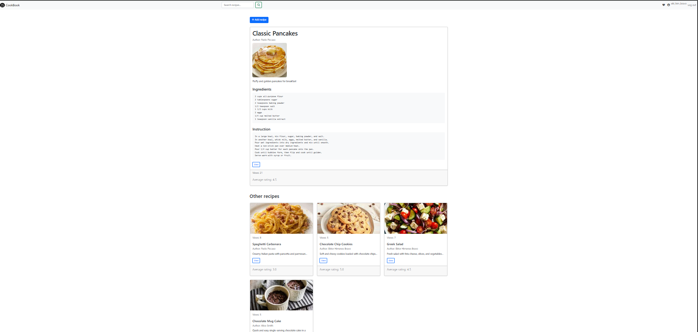
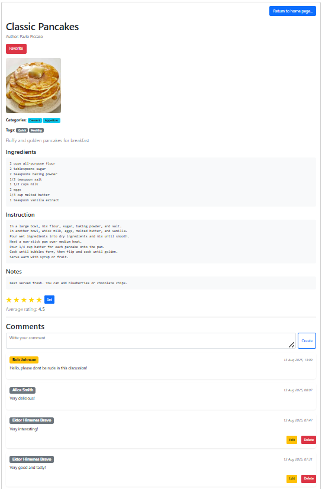
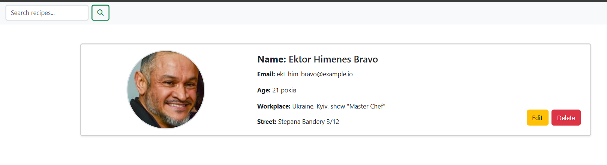
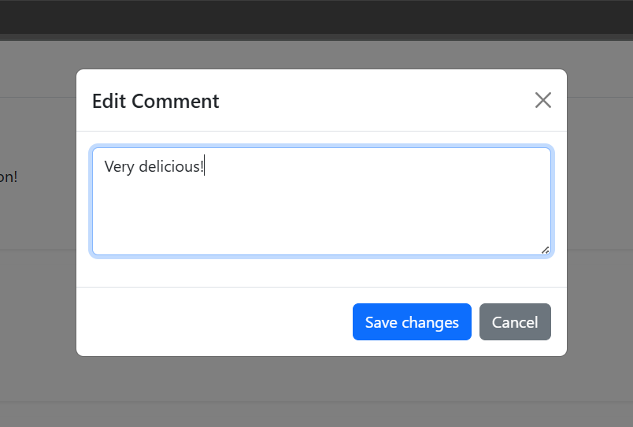
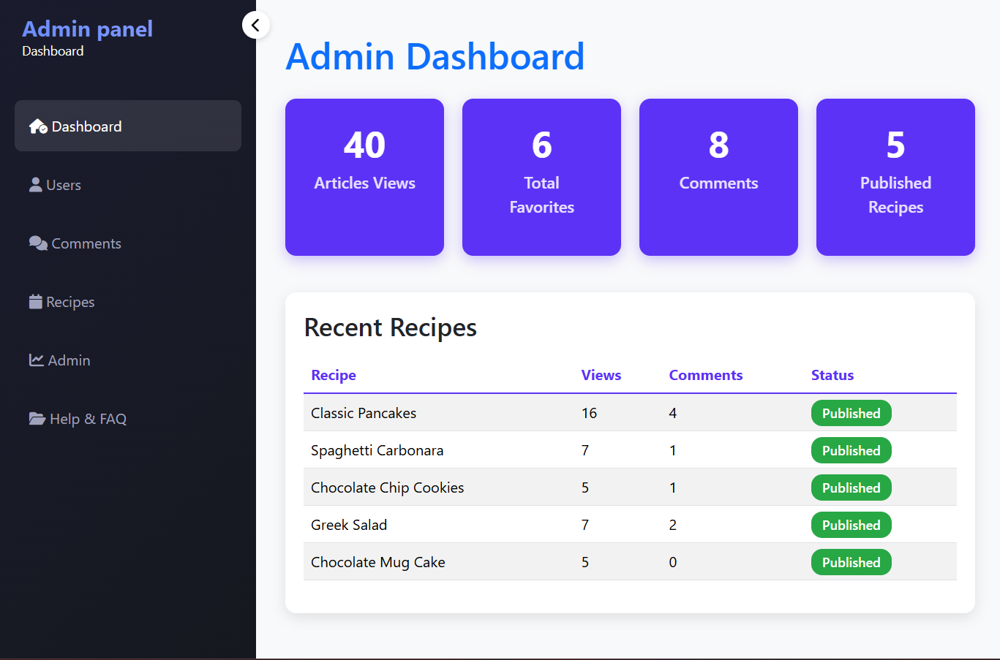

<h2 style="text-align:center">Recipes Base</h2>

<strong>Recipes Base</strong> is a simple yet powerful application for managing recipes, including <strong>creating, editing, commenting, and administration via the admin panel</strong>.

Users can upload images for both recipes and their profiles, and each recipe is linked to an author. The project demonstrates core web development principles, including user authentication, file uploads, and database integration.

The application is built with <strong>Flask</strong> (a lightweight Python web framework), using <strong>SQLAlchemy</strong> as the ORM and <strong>SQLite</strong> as the database. Uploaded images are securely stored on the server and displayed alongside post content.

<h2>Technologies:</h2>
<ul>
    <li>Python</li>
    <li>Flask</li>
    <li>SQLAlchemy</li>
    <li>Jinja2 templates</li>
    <li>Werkzeug (for secure file handling)</li>
    <li>HTML + CSS</li>
    <li>JavaScript (for live client-side previews)</li>
</ul>

<h2 style="text-align:center">How to Install the Project</h2>
<h3>Server-side Setup:</h3>
<ol>
  <li>Clone the repository and navigate into the project directory.</li>
  <li>(Optional) Create and activate a Python virtual environment:
    <code>python -m venv venv</code> and <code>source venv/bin/activate</code> (or <code>venv\Scripts\activate</code> on Windows).
  </li>
  <li>Install the required dependencies:
    <code>pip install -r requirements.txt</code>.
  </li>
  <li>Run the Flask development server in debug mode:
    <code>python3 -m flask --app Recipes run --debug</code>.
  </li>
  <li>Open your browser and navigate to <code>http://localhost:5000</code> to access the application.</li>
  <li>Edit tags and categories in the file <code>init_data.py</code>. Example of initial data: 
  <pre>
initial_categories = [
    Category(name='Dessert'),
    Category(name='Main Course'),
    Category(name='Salad'),
    Category(name='Appetizer'),
    Category(name='Second')
]
  </pre>
  <pre>
initial_tags = [
    Tag(name='Vegan'),
    Tag(name='Gluten-free'),
    Tag(name='Quick'),
    Tag(name='Healthy'),
    Tag(name='For Sport'),
    Tag(name='For Movies')
]
  </pre>
  </li>
  <li>To add this data to the tables, go to the project directory and run:
    <code>python3 init_date.py</code>
  </li>
</ol>

<h2>Viewing the Database Tables</h2>

You can choose one of the following methods:

<ol>
  <li>Install <strong>DB Browser for SQLite</strong> from its <a href="https://sqlitebrowser.org/" target="_blank" style="color: grey;">official website</a>.</li>
  <li>If you are using VS Code, install the <strong>SQLite</strong> and <strong>SQLite Viewer</strong> extensions.</li>
</ol>

<h2>Image Uploads:</h2>
<ul>
  <li>Allowed formats: PNG, JPG, JPEG, GIF.</li>
  <li>Images are stored in the <code>static/uploads</code> folder. [if this recipe picture]</li>
  <li>Images are stored in the <code>static/avatar</code> folder. [if this user avatar]</li>
  <li>A default image is displayed if no image is provided for a post.</li>
</ul>

<em>Note:</em> Handle images carefully and avoid uploading files that could compromise server security.

<h2 style="text-align:center">Demo Screenshots</h2>

    

<em>Figure: Main page of Recipes Base application</em>

 

    

<em>Figure: Recipe page</em>

 

    

<em>Figure: User page</em>

 

    

<em>Figure: Editing comment</em>

 

    

<em>Figure: Admin Dasboard</em>

